# Hackathon Project


## Overview

This project is a React Native application designed to provide an interactive map experience with user authentication and dynamic route tracking and _social hub (only mockup)_. The app integrates with Apollo Client for GraphQL queries and mutations and
takes advantage of real time data rendering.

## Features

- [ ] **User Authentication**: Login with Google or email.  _mockup_
- [x] **Interactive Map**: Real-time location tracking and route navigation.
- **Question and Answer**: Users can answer questions at specific points on the route.
- [x] **Progress Tracking**: Track user progress along the route.
- [x] **Route Information**: Display additional information about the route.
- [ ] **Social Hub**: Interact with other users and share experiences. _mockup_
- [x] **Questionnaire**: Answer questions to test your knowledge and gain access to further points.
- [x] **Map dynamic display**: Displaying points of interest on the map.
- [x] **Map shortcut**: Quick access to the whole route from the start plan screen.
- [x] **Real time path tracking**: Displaying the user's current location on the map and accurate path from his location to destination.

## Tech Stack

- **Languages**: TypeScript
- **Frameworks**: React Native
- **Libraries**: Apollo Client, Expo, React Navigation
- **Tools**: WebStorm, npm

## Setup

### Prerequisites

- Node.js
- npm
- Expo CLI

### Installation

1. Clone the repository:
    ```sh
    git clone https://github.com/legumina-hackyeah-2024/mobile.git
    cd mobile
    ```

2. Install dependencies:
    ```sh
    npm install
    ```

3. Set up environment variables:
    - Create a `.env` file in the root directory.
    - Add the following variables:
        ```env
        EXPO_PUBLIC_JWT=your_jwt_token
        EXPO_PUBLIC_API_KEY=your_google_maps_api_key
        ```

### Running the App

1. Start the Expo development server:
    ```sh
    npx expo start
    ```

2. Use the Expo Go app on your mobile device to scan the QR code and run the app.

### Detailed Overview
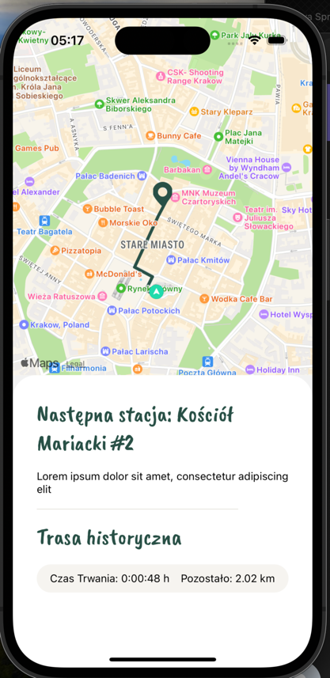
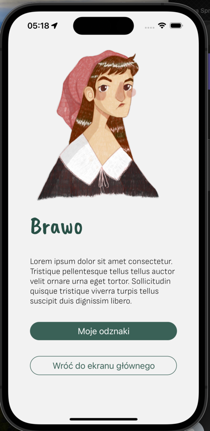
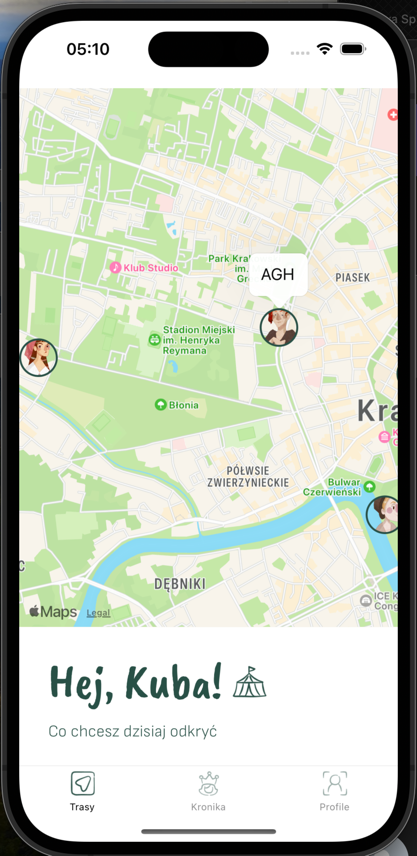
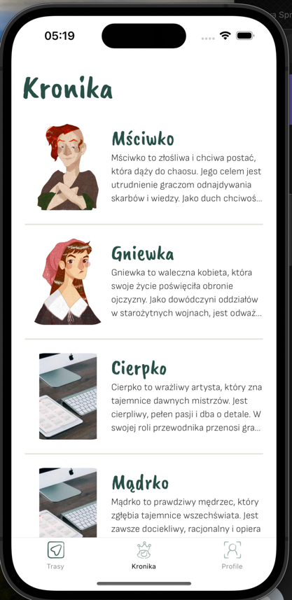
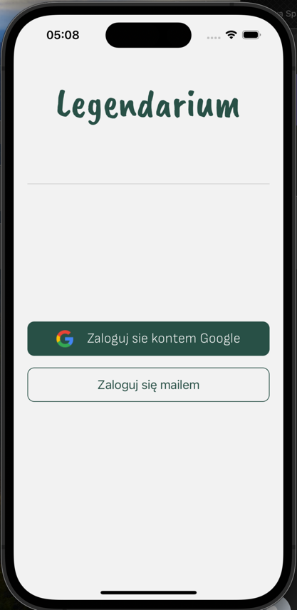

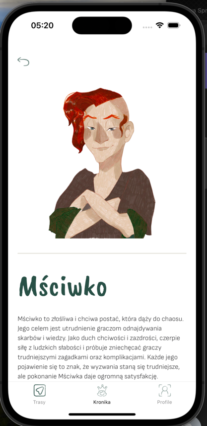
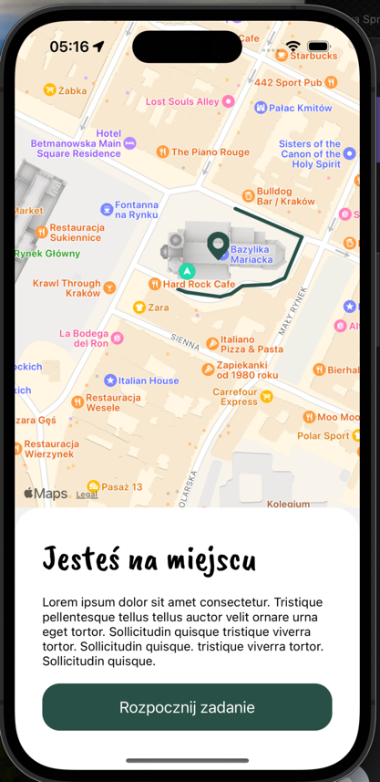


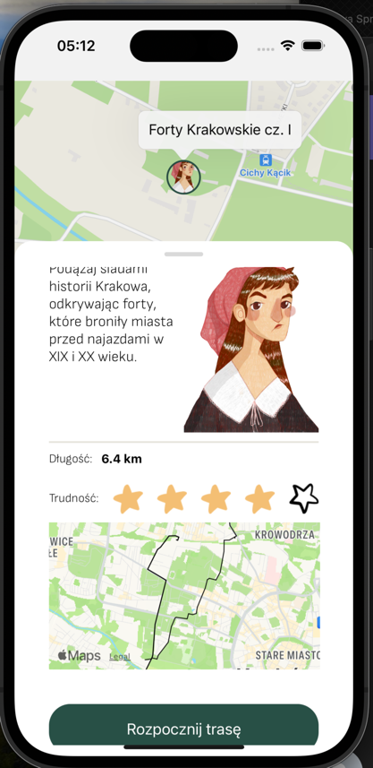
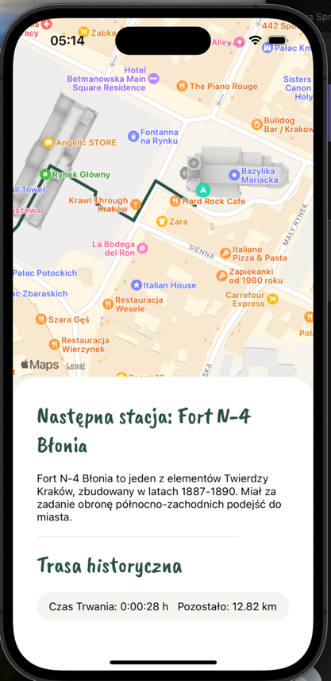
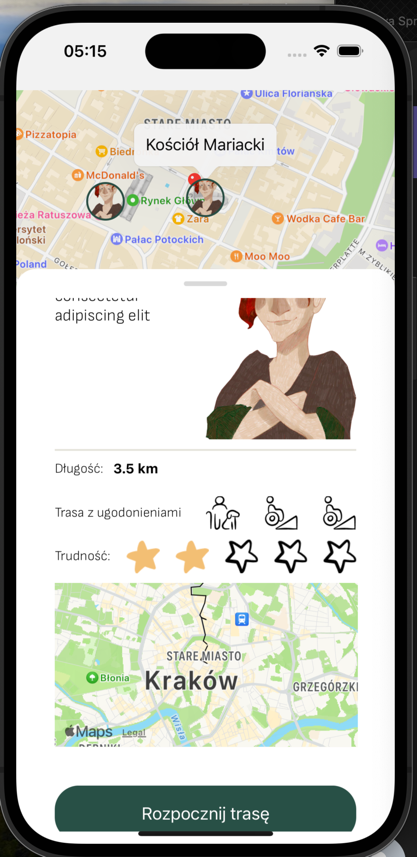
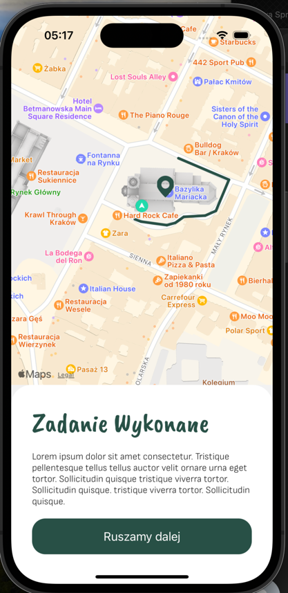
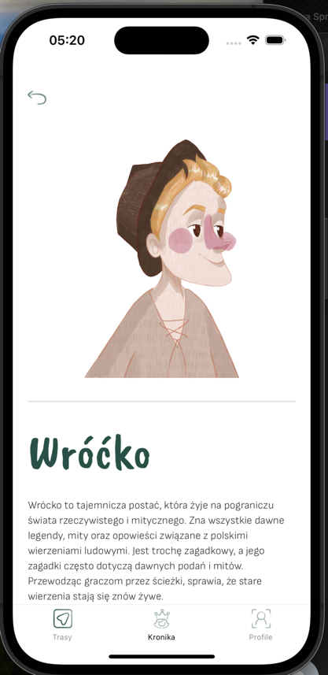
